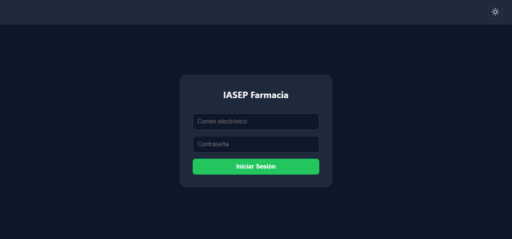
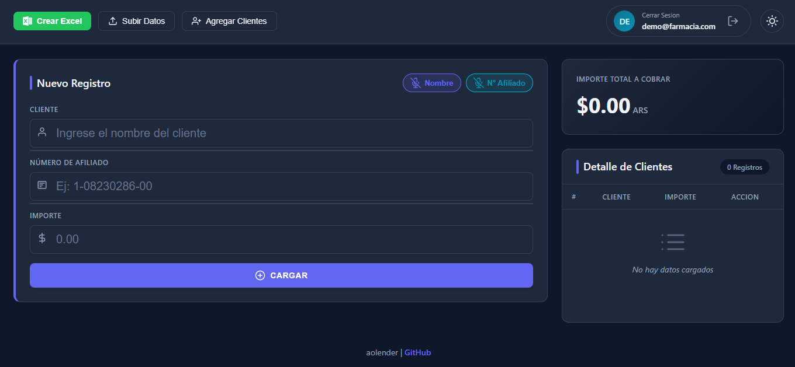
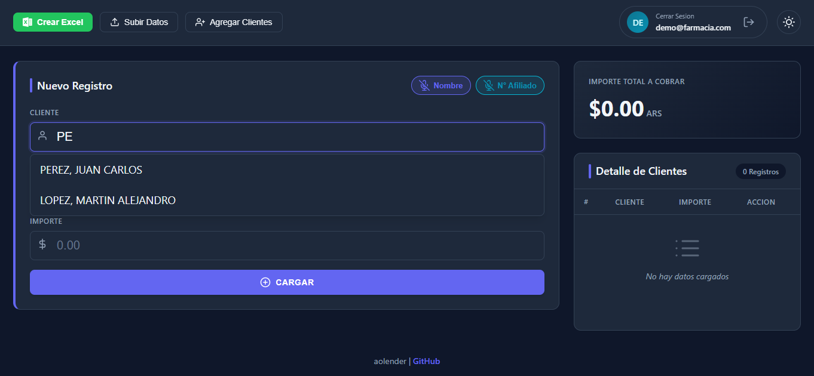
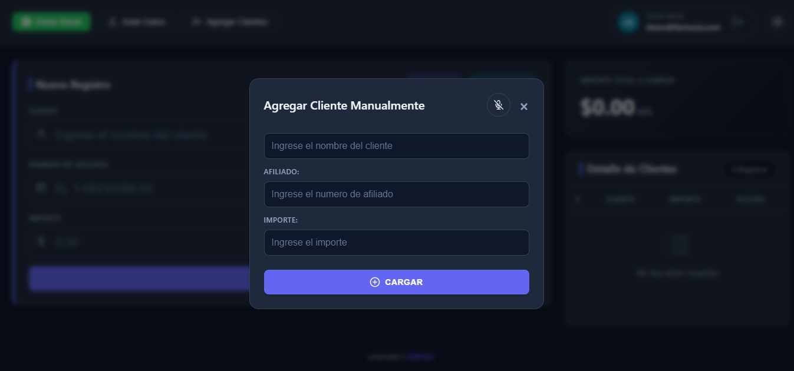
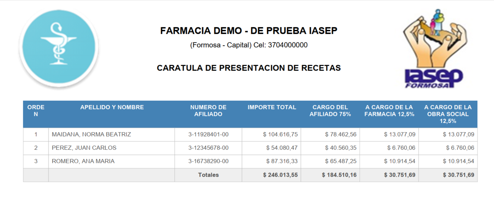

# 🏥 IASEP Farmacias — Sistema de Gestión y Carga de Comprobantes

[](https://aolender1.github.io/IASEP-app/)
[](https://neon.tech/)
[](LICENSE.md)

Aplicación web profesional para la gestión, registro de comprobantes y consolidación de datos de la obra social **IASEP** (Instituto de Asistencia Social para el Empleado Público). Permite procesar planillas de clientes desde archivos Excel, realizar autocompletado rápido o dictado por voz en tiempo real, calcular totales de liquidación y generar reportes consolidados en Excel de manera ágil e intuitiva.

---

## 🚀 **Acceso Demo Público**

Puedes probar la aplicación en vivo sin necesidad de registro previo ingresando con la siguiente **cuenta demo pública**:

| Parámetro | Credenciales & Datos Demo |
| :--- | :--- |
| 🌐 **URL de la App** | [https://aolender1.github.io/IASEP-app/](https://aolender1.github.io/IASEP-app/) |
| 📧 **Correo Electrónico** | `demo@farmacia.com` |
| 🔑 **Contraseña** | `demo123456` |
| 🏥 **Nombre Farmacia** | `FARMACIA DEMO - DE PRUEBA IASEP` |
| 📍 **Ubicación** | `(Formosa - Capital) Cel: 3704000000` |

---

## 📥 **Archivo Excel de Ejemplo para Pruebas**

Para probar la importación de datos y la función de autocompletado/dictado inmediatamente, puedes descargar el archivo de datos de prueba precargado con nombres y afiliados argentinos:

👉 **[Descargar datos_demo.xlsx](https://github.com/aolender1/IASEP-app/raw/main/datos_demo.xlsx)** *(incluido en este repositorio)*

### **Estructura del archivo `datos_demo.xlsx`:**
El archivo contiene la hoja requerida **`base-de-datos`** con el formato exacto que interpreta la aplicación:

| ID | NOMBRE | NUMERO |
| :-: | :--- | :--- |
| 1 | PEREZ, JUAN CARLOS | 3-12345678-00 |
| 2 | GOMEZ, DIEGO HERNAN | 3-14825472-00 |
| 3 | GONZALEZ, MARIA ELENA | 3-20493817-00 |
| 4 | FERNANDEZ, LUCAS GABRIEL | 3-31582940-00 |
| ... | ... | ... |

---

## 🖼️ **Vista Previa del Proyecto (Capturas de Pantalla)**

> *Las capturas a continuación muestran el flujo de uso de la aplicación utilizando la cuenta demo pública.*

### **1. Inicio de Sesión / Login (Neon Auth)**

*Autenticación segura integrada con Neon PostgreSQL.*

---

### **2. Panel Principal & Carga de Archivo Excel**

*Carga de la base de clientes desde el archivo `datos_demo.xlsx`.*

---

### **3. Autocompletado Intuitivo & Dictado por Voz (`es-AR`)**

*Búsqueda inteligente por nombre o número de afiliado y asistencia por dictado de voz para agilizar el ingreso.*

---

### **4. Registro Manual de Nuevos Clientes**

*Formulario modal para incorporar clientes que no estaban en la planilla inicial.*

---

### **5. Generación e Historial de Excel Multi-Hoja**

*Descarga del reporte consolidado con hojas estructuradas (`base-de-datos`, `Datos`, `Nuevos Clientes`).*

---

## ✨ **Características Destacadas**

- **🔐 Autenticación en la Nube**: Inicio de sesión mediante **Neon Auth** y conexión a base de datos **Neon PostgreSQL (Serverless)**.
- **📊 Carga Directa desde Excel**: Lectura de planillas `.xlsx` desde la hoja `"base-de-datos"` sin necesidad de convertir archivos a JSON.
- **⚡ Autocompletado Bivalente**: Búsqueda instantánea de afiliados escribiendo tanto por **Nombre y Apellido** como por **Número de Afiliado**.
- **🎙️ Dictado por Voz en Español (`es-AR`)**: Reconocimiento de voz nativo (Web Speech API) para ingresar clientes, afiliados e importes manos libres.
- **➕ Gestión de Clientes Nuevos**: Incorporación rápida de afiliados no registrados mediante un modal persistente.
- **🧮 Cálculo Automático de Obra Social**: Liquidación e importes calculados en tiempo real según los parámetros de la obra social.
- **📄 Generación de Reportes Excel**: Descarga automática de un archivo `datos.xlsx` actualizado con 3 hojas organizadas:
  1. `base-de-datos`: Lista completa de clientes antiguos y nuevos ordenados alfabéticamente con IDs secuenciales.
  2. `Datos`: Registros cargados en la sesión actual (`ORDEN`, `NOMBRE`, `AFILIADO`, `IMPORTE`).
  3. `Nuevos Clientes`: Registro exclusivo de clientes dados de alta manualmente.
- **🌙 Modo Claro / Oscuro**: Interruptor de tema visual con persistencia automática en `localStorage`.

---

## 🛠️ **Tecnologías Utilizadas**

- **HTML5 & CSS3**: Diseño moderno, responsive, adaptado a dispositivos móviles y escritorio.
- **JavaScript (ES6+)**: Lógica cliente, manipulación del DOM, eventos de teclado y voz.
- **[Neon Serverless PostgreSQL](https://neon.tech/) & Neon Auth**: Autenticación de usuarios y backend serverless.
- **[XLSX.js (SheetJS)](https://sheetjs.com/)**: Procesamiento y generación de libros de cálculo Excel en el navegador.
- **Web Speech API**: Dictado por voz integrado para el idioma español de Argentina.

---

## 📋 **Instrucciones de Uso (Paso a Paso)**

1. **Ingresar a la Aplicación**:
   - Accede a **[https://aolender1.github.io/IASEP-app/](https://aolender1.github.io/IASEP-app/)**.
2. **Iniciar Sesión**:
   - Utiliza la cuenta demo pública: `demo@farmacia.com` / `demo123456`.
3. **Cargar la Base de Clientes**:
   - Haz clic en **"Subir Datos en Excel"** y selecciona el archivo **`datos_demo.xlsx`**.
4. **Ingresar Registros**:
   - Escribe el nombre o número de afiliado (o activa el dictado por voz 🎙️).
   - Ingrese el importe correspondiente y presiona **Enter** o el botón **"CARGAR"**.
5. **Agregar Clientes Nuevos (Opcional)**:
   - Haz clic en **"Agregar Clientes Manualmente"** para abrir el modal y añadir afiliados que no figuraban en la planilla original.
6. **Exportar el Reporte**:
   - Presiona **"Crear Excel"** para descargar el archivo de datos actualizado con los totales procesados.

---

## 📂 **Estructura del Proyecto**

```
IASEP-app/
│
├── index.html            # Interfaz principal del sistema
├── login.html            # Pantalla de autenticación / inicio de sesión
├── script.js             # Lógica principal, autocompletado, dictado y Excel
├── neon-config.js        # Configuración de endpoints de Neon Auth y Data API
├── styles.css            # Estilos globales, variables CSS y temas (claro/oscuro)
├── datos_demo.xlsx       # Archivo Excel de prueba para la cuenta demo
│
├── assets/               # Recursos gráficos e íconos
│   ├── favicon.ico
│   ├── delete-icon.svg
│   └── screenshots/      # Capturas de pantalla para el README.md
│       ├── 01-login.png
│       ├── 02-panel-principal.png
│       ├── 03-autocompletado-dictado.png
│       ├── 04-carga-manual.png
│       └── 05-exportacion.png
│
├── LICENSE.md            # Licencia del proyecto (MIT)
└── README.md             # Documentación del proyecto
```

---

## 👤 **Créditos y Autoría**

Desarrollado por **[Alberto Olender (aolender1)](https://github.com/aolender1)** para optimizar el registro y la facturación de afiliados en farmacias que operan con la obra social IASEP.

---

## 📄 **Licencia**

Este proyecto se distribuye bajo la licencia **MIT**. Puedes utilizarlo y modificarlo libremente.
